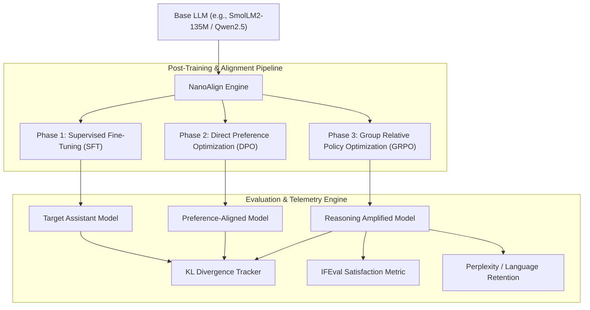
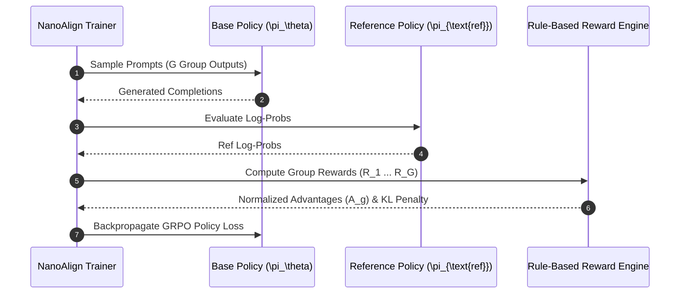

<div align="center">

# ⚡ NanoAlign (Formerly nano-llm-posttraining)

### Minimal, Reproducible LLM Post-Training & Alignment Framework on an 8GB GPU

[](https://linkedin.com/in/nachiket-gadilohar-profile/)
[](https://linkedin.com/in/nachiket-gadilohar-profile/)
[](https://github.com/nachiket0987/NanoAlign)
[](https://python.org)
[](https://pytorch.org)
[](https://huggingface.co/docs/trl)
[](https://docker.com)
[](LICENSE)

</div>

---

## 🎯 Executive Overview & Value Proposition

**NanoAlign** is a lightweight, production-grade LLM post-training and evaluation suite designed to run complete **SFT, DPO, and GRPO (Group Relative Policy Optimization)** alignment pipelines on consumer hardware (starting at a single **8GB VRAM GPU**).

Built on top of **HuggingFace TRL** and optimized with **uv**, NanoAlign allows AI engineers and researchers to empirically observe and measure key post-training phenomena:
1. **RL's Razor**: Demonstrating how on-policy Reinforcement Learning (GRPO) achieves target task mastery with significantly less distribution drift (measured via Forward KL divergence $D_{\text{KL}}(\pi_{\text{ft}} \| \pi_{\text{base}})$) than Supervised Fine-Tuning (SFT).
2. **DeepSeek-R1 Style Reasoning Amplification**: Squeezing out intrinsic chain-of-thought (CoT) verification and search behavior on reasoning tasks (e.g., Countdown & GSM8K) using rule-based reward functions.

---

## ✨ Key Features

- 🚀 **Minimal GPU Footprint**: Run end-to-end SFT, DPO, and GRPO on a 135M model using **<8GB VRAM**. Scale up to 3B models on a 48GB GPU.
- 🔬 **Empirical KL Tracking**: Quantify language capability degradation and catastrophic forgetting by tracking per-token Forward KL divergence against baseline models.
- 💡 **DeepSeek-Style GRPO Reasoning**: Reinforce self-verification and search patterns without complex PPO critic networks or external reward models.
- ⚙️ **Reproducible Tooling**: Fully pinned environment using `uv` with CUDA 12.8 wheel support and optional vLLM acceleration.
- 🐳 **Production Docker Support**: Instant multi-stage Docker containerization and Docker Compose setup.

---

## 📐 System Architecture & Data Flow



### Alignment Data Flow



---

## ⚡ Quick Start

### 1. Installation (Local CLI)

Clone the repository and sync dependencies using `uv`:

```bash
git clone https://github.com/nachiket0987/NanoAlign.git
cd NanoAlign

# Sync Python 3.12 dependencies
uv sync

# (Optional) Enable vLLM acceleration for fast GRPO rollouts
uv sync --extra vllm
```

### 2. Running Post-Training Modules

```bash
# Experiment 1: SFT on 135M model (~8GB VRAM)
uv run python -m src.identity_sft

# Experiment 2: Direct Preference Optimization (DPO)
uv run python -m src.dpo

# Experiment 3: GRPO Reasoning Amplification on Countdown task
uv run python -m src.grpo_countdown

# Experiment 4: Calculate Forward KL & Retention Metrics
uv run python -m src.kl_analysis
```

### 3. Docker & Standalone Deployment

Run NanoAlign inside isolated GPU containers:

```bash
# Build and launch via Docker Compose
docker-compose up --build -d

# Check dashboard logs
docker logs -f nanoalign-worker
```

---

## 📚 Core Engineering Documentation (`docs/`)

Explore the production specification suite in the `docs/` folder:

1. [📄 **Product Requirement Document (PRD)**](docs/PRD.md): Vision, user personas, quantitative KPIs, and scope matrix.
2. [📄 **Software Requirements Specification (SRS)**](docs/SRS.md): Functional specs, RBAC matrix, encryption, and SLA limits.
3. [📄 **System Architecture Document**](docs/ARCHITECTURE.md): Deep-dive into TRL integration, data pipelines, schema, and HA scaling.
4. [📄 **UI/UX Specification Document**](docs/UI_UX_DESIGN.md): Theme tokens, dashboard ASCII wireframes, states, and WCAG AA guidelines.
5. [📄 **Development Plan & Roadmap**](docs/DEVELOPMENT_PLAN.md): 5-phase execution plan, Gantt chart, task matrix, and Definition of Done.

---

## 👨‍💻 Author & Contact

**Nachiket Gadilohar**
- **Email**: [nachiketlohar0306@gmail.com](mailto:nachiketlohar0306@gmail.com)
- **GitHub**: [github.com/nachiket0987](https://github.com/nachiket0987)
- **LinkedIn**: [linkedin.com/in/nachiket-gadilohar-profile](https://linkedin.com/in/nachiket-gadilohar-profile/)

---

<div align="center">
  <sub>Built with ❤️ by Nachiket Gadilohar for the Open-Source AI Community.</sub>
</div>
