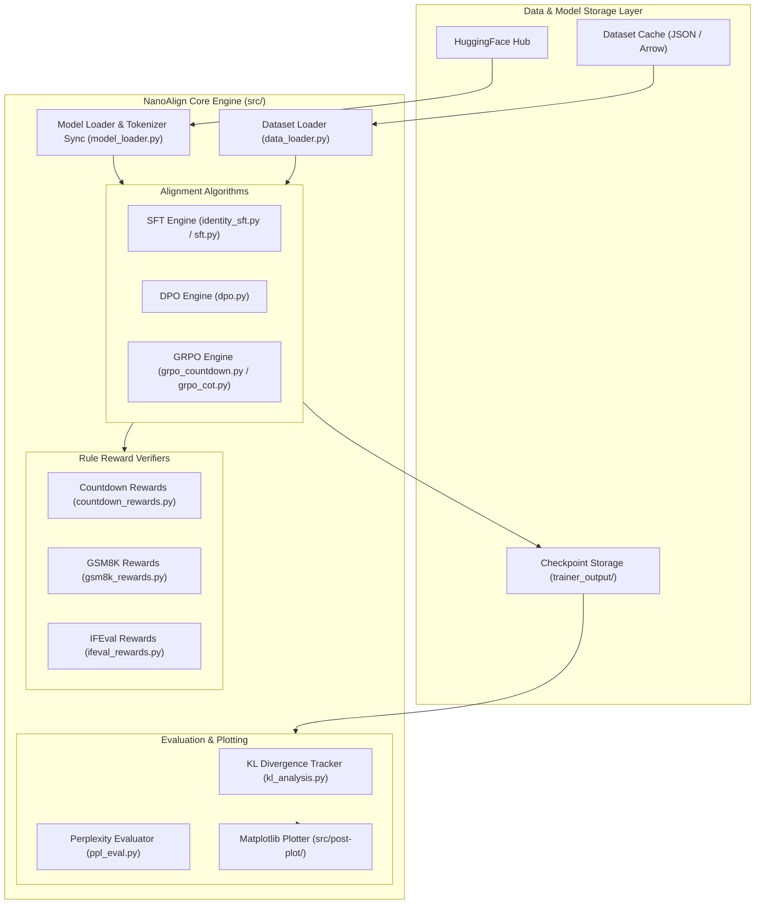
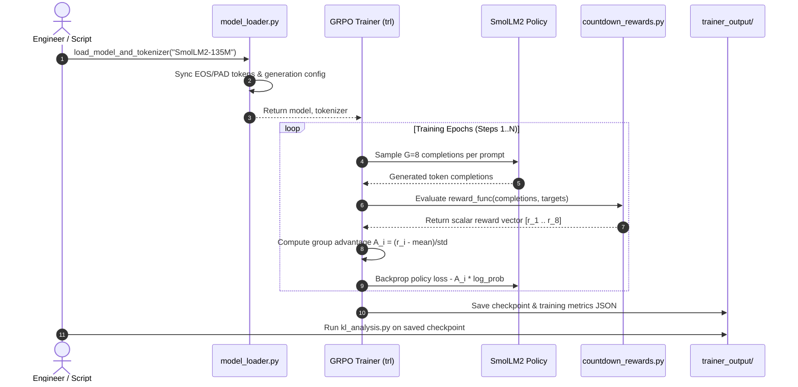

# System Architecture Document (SAD)

## Project: NanoAlign
**Author**: Nachiket Gadilohar ([nachiketlohar0306@gmail.com](mailto:nachiketlohar0306@gmail.com))  
**Repository**: [github.com/nachiket0987/NanoAlign](https://github.com/nachiket0987/NanoAlign)  
**Document Version**: 1.0.0  

---

## 1. System Overview & Tech Stack Table

NanoAlign is designed around a modular, decoupled architecture where training algorithms, reward verification engines, dataset loaders, and plotting/evaluation modules operate independently.

| Layer | Component | Technology / Library |
| :--- | :--- | :--- |
| **Language / Runtime** | Core Runtime | Python 3.12, PyTorch 2.6+ (cu128) |
| **Package Manager** | Dependency Resolver | Astral `uv` |
| **LLM Engine** | Model & Tokenizer | HuggingFace `transformers`, `peft` |
| **Alignment Trainers**| SFT / DPO / GRPO | HuggingFace `trl` |
| **Inference Acceleration**| Rollout Engine | Optional `vllm` 0.16.x |
| **Evaluation & Telemetry**| Benchmark Engine | `lm-eval`, `matplotlib`, `rich` |
| **Containerization** | Infrastructure | Docker, Docker Compose, Nginx |

---

## 2. System Architecture Diagram



---

## 3. Data Flow Sequence Diagram



---

## 4. Package & Component Breakdown

```
NanoAlign/
├── Dockerfile                  # Multi-stage GPU container definition
├── docker-compose.yml          # Container orchestration suite
├── nginx.conf                  # Nginx proxy for metric dashboards
├── pyproject.toml              # UV project definition & dependencies
├── README.md                   # Executive documentation
├── docs/                       # Engineering Specification Suite
│   ├── PRD.md
│   ├── SRS.md
│   ├── ARCHITECTURE.md
│   ├── UI_UX_DESIGN.md
│   └── DEVELOPMENT_PLAN.md
├── assets/                     # Generated charts & visual graphics
│   └── figures/
└── src/                        # Core Python Package
    ├── __init__.py             # Package init & dprint debug switch
    ├── model_loader.py         # Model loading & generation timing
    ├── data_loader.py          # Data ingestion utilities
    ├── identity_sft.py         # 135M SFT experiment baseline
    ├── sft.py                  # Standard SFT pipeline
    ├── dpo.py                  # Direct Preference Optimization
    ├── grpo_countdown.py       # GRPO Countdown reasoning trainer
    ├── countdown_rewards.py    # Equation format & target check reward
    ├── kl_analysis.py          # Forward KL divergence engine
    ├── ppl_eval.py             # Language retention evaluator
    └── post-plot/              # Publication graphic generators
        ├── razor_pareto.py
        ├── countdown_curve.py
        └── ppl_forgetting.py
```

---

## 5. Security & Deployment Architecture

- **Isolated Execution**: Containers run with explicit GPU reservations via Docker Compose device mappings.
- **Stateless Verification**: Reward engines execute in pure Python memory without external database or RPC network overhead.
- **CI/CD Integration**: Pre-commit hooks validate formatting via `ruff` and imports via `pyright`.
