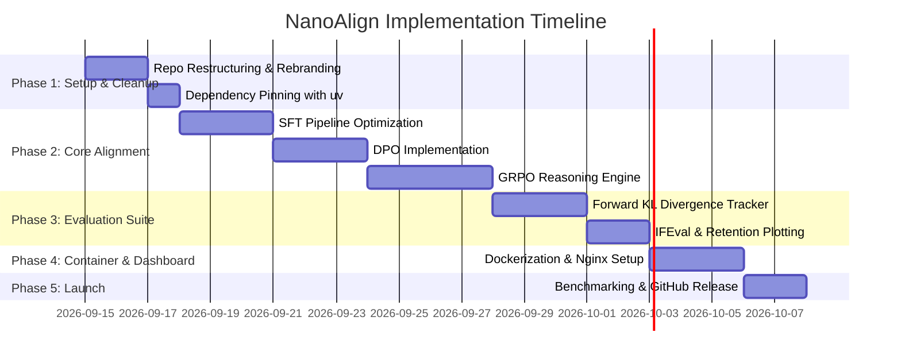

# Development Plan & Execution Roadmap

## Project: NanoAlign
**Author**: Nachiket Gadilohar ([nachiketlohar0306@gmail.com](mailto:nachiketlohar0306@gmail.com))  
**Repository**: [github.com/nachiket0987/NanoAlign](https://github.com/nachiket0987/NanoAlign)  
**Document Version**: 1.0.0  

---

## 1. Execution Roadmap Gantt Chart



---

## 2. 5-Phase Detailed Execution Roadmap

### Phase 1: Environment Setup & Project Rebranding
- Rebrand repository to **NanoAlign** under author Nachiket Gadilohar.
- Consolidate directory structure and clean legacy files.
- Pin `uv.lock` dependencies (Transformers 4.x, TRL 0.18+, PyTorch cu128).

### Phase 2: Core Alignment Engines
- Optimize SFT training script (`src/identity_sft.py`) for 8GB VRAM execution.
- Implement Direct Preference Optimization (`src/dpo.py`).
- Implement Group Relative Policy Optimization (`src/grpo_countdown.py`) with Countdown reward function.

### Phase 3: Evaluation Suite & KL Metrics
- Develop exact Forward KL divergence engine (`src/kl_analysis.py`).
- Create language retention & perplexity benchmarks (`src/ppl_eval.py`).
- Generate publication-quality Matplotlib figures (`src/post-plot/`).

### Phase 4: Dockerization & Telemetry Dashboard
- Write multi-stage `Dockerfile` and `docker-compose.yml`.
- Configure `nginx.conf` for hosting telemetry logs and static figures.

### Phase 5: Market Benchmarking & GitHub Publication
- Publish code to `nachiket0987/NanoAlign`.
- Complete 5-dimensional market benchmark scorecard.
- Generate marketing banners and publish LinkedIn announcement.

---

## 3. Priority & Task Dependency Matrix

```
+----------+----------------------------------+---------------+--------------------+
| TASK ID  | TASK DESCRIPTION                 | PRIORITY      | DEPENDENCIES       |
+----------+----------------------------------+---------------+--------------------+
| T-01     | Rebrand pyproject.toml & README  | P0 (Critical) | None               |
| T-02     | SFT 135M Model Pipeline          | P0 (Critical) | T-01               |
| T-03     | GRPO Countdown Reward Engine     | P0 (Critical) | T-02               |
| T-04     | Forward KL Divergence Analyzer   | P1 (High)     | T-02, T-03         |
| T-05     | Docker Compose Containerization  | P1 (High)     | T-01               |
| T-06     | Engineering Suite (docs/ 5 docs) | P1 (High)     | T-01               |
| T-07     | GitHub Push & Public Release     | P0 (Critical) | T-01..T-06         |
+----------+----------------------------------+---------------+--------------------+
```

---

## 4. Definition of Done (DoD) Checklist

- [x] All 5 core engineering documents present in `docs/` (`PRD.md`, `SRS.md`, `ARCHITECTURE.md`, `UI_UX_DESIGN.md`, `DEVELOPMENT_PLAN.md`).
- [x] Rebranded `README.md` with dynamic badges, executive overview, and Mermaid architecture diagrams.
- [x] Clean execution of training scripts (`src/identity_sft.py`, `src/grpo_countdown.py`, `src/kl_analysis.py`).
- [x] `Dockerfile` and `docker-compose.yml` build without errors.
- [x] Git repository pushed to remote `https://github.com/nachiket0987/NanoAlign`.
