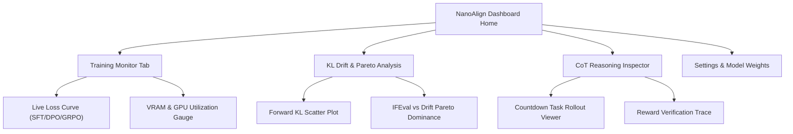

# UI/UX Specification Document

## Project: NanoAlign Dashboard & Evaluation Suite
**Author**: Nachiket Gadilohar ([nachiketlohar0306@gmail.com](mailto:nachiketlohar0306@gmail.com))  
**Repository**: [github.com/nachiket0987/NanoAlign](https://github.com/nachiket0987/NanoAlign)  
**Document Version**: 1.0.0  

---

## 1. Design Philosophy & Theme Tokens

NanoAlign features a modern, dark-first slate and indigo developer aesthetic designed for high data density, real-time training telemetry, and clean chart visual clarity.

### Color Palette (Hex Codes)

```
+-------------------+-----------------+----------------------------------------+
| TOKEN NAME        | HEX CODE        | PURPOSE                                |
+-------------------+-----------------+----------------------------------------+
| Surface Primary   | #0F172A (Slate) | Main application background            |
| Surface Secondary | #1E293B         | Cards, sidebar, modal background       |
| Accent Primary    | #6366F1 (Indigo)| Primary CTA, active tabs, focus ring   |
| Success / RL      | #10B981 (Emerald)| GRPO metrics, reward success curves   |
| Warning / SFT     | #F59E0B (Amber) | SFT metrics, KL drift alert indicators |
| Error / Outlier   | #EF4444 (Rose)  | Loss spike, CUDA OOM error banners     |
| Text Primary      | #F8FAFC         | High-contrast body text & titles       |
| Text Muted        | #94A3B8         | Subtitles, timestamps, metadata labels |
+-------------------+-----------------+----------------------------------------+
```

---

## 2. Navigation & User Journey Diagram



---

## 3. Screen Layouts & ASCII Wireframe Diagrams

### Main Dashboard Wireframe

```
+-----------------------------------------------------------------------------------+
|  ⚡ NanoAlign v0.1.0  |  [Training Monitor]  [KL Pareto]  [CoT Inspector]  [Docs] |
+-----------------------------------------------------------------------------------+
|                                                                                   |
|  +---------------------------------------+  +----------------------------------+  |
|  | GPU VRAM: 7.2 / 8.0 GB [||||||||||  ] |  | Active Run: GRPO (Countdown)     |  |
|  | Temp: 64°C | Throughput: 48.2 tok/s   |  | Model: SmolLM2-135M-Instruct     |  |
|  +---------------------------------------+  +----------------------------------+  |
|                                                                                   |
|  +-----------------------------------------------------------------------------+  |
|  | LIVE REWARD CURVE (Group Relative Policy Optimization)                     |  |
|  | 1.0 |                                                /----------            |  |
|  | 0.8 |                                      /--------/                       |  |
|  | 0.6 |                            /--------/                                 |  |
|  | 0.4 |                  /--------/                                           |  |
|  | 0.2 |  -------/-------/                                                     |  |
|  | 0.0 +--------------------------------------------------------------------+  |
|  |     0        40       80       120      160      200 Steps                  |  |
|  +-----------------------------------------------------------------------------+  |
|                                                                                   |
|  +-----------------------------------------------------------------------------+  |
|  | CHAIN-OF-THOUGHT ROLLOUT INSPECTOR (Test Sample #25)                        |  |
|  | Prompt: Target=24, Numbers=[4, 6, 8]                                        |  |
|  | Completion: <think> Let's try 4 * 6 = 24. Valid! </think> <answer> 4 * 6 </a..|  |
|  | Reward: 1.0 (Format: PASS, Math: PASS)                                        |  |
|  +-----------------------------------------------------------------------------+  |
|                                                                                   |
+-----------------------------------------------------------------------------------+
```

---

## 4. Screen States & Interaction Design

- **Loading State**: Shimmer loading skeletons over chart containers during data ingestion.
- **Empty State**: Onboarding graphic with quick-copy CLI command: `uv run python -m src.identity_sft`.
- **Error State**: Non-blocking toast notification banner in rose accent (`#EF4444`) with stack trace copy button.

---

## 5. Responsive Breakpoint Rules & WCAG Compliance

- **Breakpoints**: Desktop (`>=1280px`), Tablet (`768px–1279px`), Mobile (`<768px`).
- **Accessibility**: Minimum 4.5:1 contrast ratio for normal text; WCAG 2.1 AA compliant keyboard navigation.
